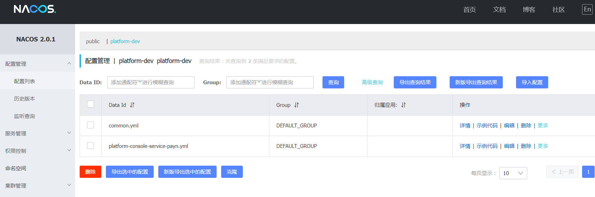
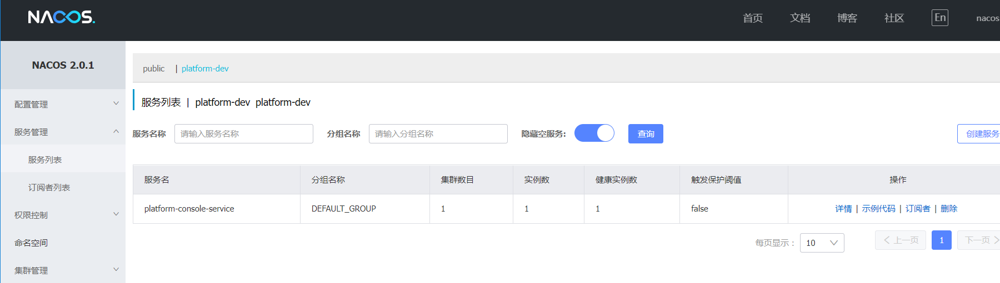

# platform-console
platform-console

## 一、项目结构
### 1.1、结构
```
platform-console
    platform-console-control-parent         操作台control父工程
        platform-control-console            操作台control-PC端
        platform-control-{app}-control      操作台control-APP端
    platform-console-service-parent         操作台service父工程
        platform-console-api                对外的API包
        platform-console-service            操作台service
```

### 1.2、API接口文档地址：  
```
http://localhost:6060/doc.html#/home
```

### 1.3、整合platform基础模块
```yaml
<!-- 基础模块START -->
<dependency>
    <groupId>com.fallframework.platform</groupId>
    <artifactId>fall-platform-starter-config</artifactId>
</dependency>
<dependency>
    <groupId>com.fallframework.platform</groupId>
    <artifactId>fall-platform-starter-file</artifactId>
</dependency>
<dependency>
    <groupId>com.fallframework.platform</groupId>
    <artifactId>fall-platform-starter-i18n</artifactId>
</dependency>
<dependency>
    <groupId>com.fallframework.platform</groupId>
    <artifactId>fall-platform-starter-mail</artifactId>
</dependency>
<dependency>
    <groupId>com.fallframework.platform</groupId>
    <artifactId>fall-platform-starter-mq</artifactId>
</dependency>
<dependency>
    <groupId>com.fallframework.platform</groupId>
    <artifactId>fall-platform-starter-rbac</artifactId>
</dependency>
<dependency>
    <groupId>com.fallframework.platform</groupId>
    <artifactId>fall-platform-starter-sms</artifactId>
</dependency>
<!-- 基础模块END -->
```

## 二、Nacos
### 2.1、安装nacos
下载地址
```
https://github.com/alibaba/nacos/releases/tag/1.1.4
```
解压安装包，直接运行bin目录下的startup.cmd   
命令运行成功后直接访问http://localhost:8848/nacos：默认账号密码都是nacos   

## 2.2、配置
### 1、公共配置
common.yml
```yaml
spring:
  main:
    allow-bean-definition-overriding: true
  servlet:
    multipart:
      max-file-size: 100MB
      max-request-size: 100MB
      enabled: false
  codec:
    max-in-memory-size: 20MB
  datasource:
    username: root
    password: root
    jdbc-url: jdbc:mysql://localhost:3306/fallplatform
    driver-class-name: com.mysql.cj.jdbc.Driver
    url: ${spring.datasource.jdbc-url}?serverTimezone=Asia/Shanghai&useUnicode=true&characterEncoding=UTF-8
    type: com.zaxxer.hikari.HikariDataSource
    hikari:
      minimum-idle: 5
      connection-test-query: SELECT 1 FROM DUAL
      maximum-pool-size: 20
      auto-commit: true
      idle-timeout: 30000
      pool-name: Wordplay-servicetest-HikariCP
      max-lifetime: 60000
      connection-timeout: 30000
  cloud:
    config:
      override-none: true
    nacos:
      discovery:
        server-addr: 127.0.0.1
        namespace: platform-dev
        group: DEFAULT_GROUP
        service: ${spring.application.name}    
  elasticsearch:
    rest:
      uris: http://127.0.0.1:9200       
  redis:
    host: localhost
    port: 6379
#   password: payn_redis$123        #密码（默认为空）
    database: 15                    #Redis索引0~15，默认为0
    timeout: 60000ms                #连接超时时间（毫秒）
    lettuce:                        # 这里标明使用lettuce配置
      pool:
        max-active: 3               #连接池最大连接数（使用负值表示没有限制）
        max-wait: -1ms              #连接池最大阻塞等待时间（使用负值表示没有限制）
        max-idle: 1                 #连接池中的最大空闲连接
        min-idle: 0                 #连接池中的最小空闲连接        
        
#tomcat配置
server:
  compression:
    enabled: true
  max-http-header-size: 102400
  error:
    include-stacktrace: on-trace-param

#mybatis-plus配置
mybatis-plus:
  # 指定枚举所在的包
  type-enums-package: com.fallframework.platform.starter
  mapper-locations: classpath:/**/mapper/*.xml
  # 实体扫描，多个package用逗号或者分号分隔
  # typeAliasesPackage: com.xkcoding.orm.mybatis.plus.entity
  global-config:
    # 数据库相关配置
    db-config:
      # 主键类型  AUTO:"数据库ID自增", INPUT:"用户输入ID",ID_WORKER:"全局唯一ID (数字类型唯一ID)", UUID:"全局唯一ID UUID";
      id-type: ID_WORKER
      # 机器 ID 部分(影响雪花ID)
      workerId: 1
      # 数据标识 ID 部分(影响雪花ID)(workerId 和 datacenterId 一起配置才能重新初始化 Sequence)
      datacenterId: 18
      # 字段策略 IGNORED:"忽略判断",NOT_NULL:"非 NULL 判断"),NOT_EMPTY:"非空判断"
      field-strategy: not_empty
      # 驼峰下划线转换
      table-underline: true
      # 是否开启大写命名，默认不开启
      #capital-mode: true
      # 逻辑删除配置
      #logic-delete-value: 1
      #logic-not-delete-value: 0
      db-type: mysql
    # 刷新mapper 调试神器
    refresh: true
  # 原生配置
  configuration:
    map-underscore-to-camel-case: true
    cache-enabled: true
    # 这个配置会将执行的sql打印出来，在开发或测试的时候可以用
    log-impl: org.apache.ibatis.logging.stdout.StdOutImpl
    default-enum-type-handler: org.apache.ibatis.type.EnumOrdinalTypeHandler
            
fall:
  file:
    upload-file-path: E://fallplatform-file/  
        
##------------------------------------------ 服务START ----------------------------------------------------## 
platform:
  console:
    service:
      name: platform-console-service-
      version: v1
    control:
      name: platform-console-control-
      version: v1    
```

### 2、个人启动服务节点的配置
注意配置格式：  
platform-console-service-{个人名称，区别唯一即可}.yml   
platform-console-control-{个人名称，区别唯一即可}.yml   

platform-console-service-payn.yml   
```yaml
server:
  port: 6060

platform:
  console:
    service:
      name: platform-console-service-
      version: payn

spring:
  application:
    name: platform-console-service
  cloud:
    config:
      override-none: true
    nacos:
      discovery:
        server-addr: 127.0.0.1
        namespace: platform-dev
        group: DEFAULT_GROUP
        service: ${spring.application.name}
```
    
    


client 对外的接口URL：   
@FeignClient(name = "${platform.console.service.name}${platform.console.service.version:}/${platform.console.service.version}/filegroup")   
${DB_HOST:localhost}表示先从配置文件yml中或者启动命令中读取DB_HOST的值，如果没有读取到，就是用默认值localhost(其他变量类似)   

service 只到version层级：  
@RequestMapping("/${platform.console.service.version}/filegroup")  


